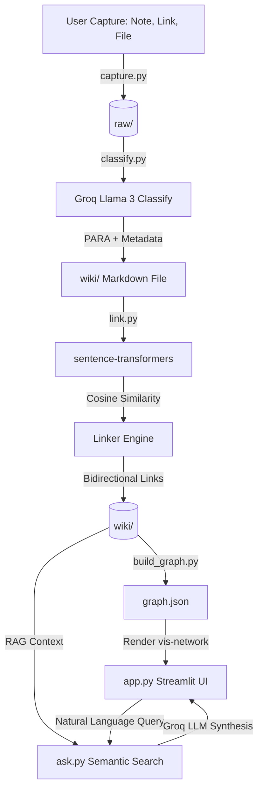

# Architecture: SecondSelf — Your Personal AI Second Brain

This document outlines the detailed system architecture for **SecondSelf**, a self-organizing personal knowledge wiki. It covers the system flow, directory structure, data schemas, module designs, and technology stack.

---

## 1. System Overview

SecondSelf is structured around a multi-stage pipeline that captures raw information, uses AI to classify and link knowledge, represents the knowledge base as a force-directed graph, and provides a semantic Q&A interface.



---

## 2. Technology Stack

- **Backend Logic & CLI**: Python 3.10+
- **Large Language Model (LLM)**: Groq Cloud API (utilizing `llama-3.1-8b-instant` or `llama3-70b-8192`) for classification and Q&A synthesis.
- **Embeddings Engine**: `sentence-transformers` (specifically the local `all-MiniLM-L6-v2` model) for generating 384-dimensional text embeddings.
- **Graph Visualization**: `vis-network` (JS library) embedded dynamically within Streamlit using custom HTML/JS templates for high-performance interactive rendering (drag, zoom, physics simulation, hover tooltips).
- **Frontend & Q&A Interface**: Streamlit (Python web application framework).

---

## 3. Directory & File Structure

```text
secondself/
├── docs/
│   ├── architecture.md           # Documentation folder architecture file
│   ├── implementation-plan.md     # Phase-by-phase implementation plan
│   └── edge-case.md               # Analysis of corner cases and mitigations
├── raw/                           # Raw inputs (notes, links, files) with unique IDs
├── wiki/                          # Self-organized PARA markdown pages with AI frontmatter
├── capture.py                     # CLI tool for capturing notes, URLs, and files
├── classify.py                    # Process raw/ items and save them as PARA-categorized markdown files
├── link.py                        # Compute embeddings and auto-link wiki pages based on semantic similarity
├── build_graph.py                 # Compile wiki pages and links into a graph.json representation
├── graph.json                     # Generated node-edge JSON for graph rendering
├── ask.py                         # Semantic retrieval and LLM Q&A reasoning (RAG)
├── app.py                         # Streamlit application (interactive graph + Q&A console)
├── requirements.txt               # Project dependencies
└── README.md                      # Setup and usage instructions
```

---

## 4. Data Schemas & Formats

### 4.1 Raw Captures (`raw/`)
Every raw item captured is saved as a JSON file containing the original inputs:
`raw/<unique_id>.json`:
```json
{
  "id": "uuid-v4-string",
  "timestamp": "2026-07-25T06:00:00Z",
  "type": "note | link | file",
  "title": "Optional User-provided Title or Extracted Title",
  "content": "Raw text content, webpage content, or extracted file contents",
  "metadata": {
    "original_source": "https://example.com"
  }
}
```
*Note: For files (like PDFs), text is extracted and saved in the `content` field, while the original file can be optionally backed up inside a subfolder `raw/attachments/`.*

### 4.2 Wiki Pages (`wiki/`)
Wiki pages are markdown files populated in the `wiki/` directory. Each file contains YAML frontmatter containing metadata parsed by the LLM:
`wiki/<unique_id>.md`:
```markdown
---
id: "uuid-v4-string"
title: "AI-Generated Concise Title"
category: "Projects | Areas | Resources | Archives"
tags: ["tag-1", "tag-2", "tag-3"]
summary: "One-line AI-generated summary of the content"
source_type: "note | link | file"
captured_at: "2026-07-25T06:00:00Z"
processed_at: "2026-07-25T06:05:00Z"
---

# AI-Generated Concise Title

Original content goes here (e.g., note text, markdown formatted webpage content, or extracted file content).

## Related Connections
- [[related-uuid-1]] (Auto-linked based on semantic similarity)
- [[related-uuid-2]]
```

### 4.3 Graph Data Model (`graph.json`)
The graph structure represents the wiki pages as nodes and their related connections as edges:
`graph.json`:
```json
{
  "nodes": [
    {
      "id": "uuid-v4-string",
      "label": "AI-Generated Title",
      "group": "Projects",
      "title": "Category: Projects | Summary: One-line summary...",
      "value": 1
    }
  ],
  "edges": [
    {
      "from": "uuid-v4-string",
      "to": "other-uuid-v4-string",
      "value": 0.76
    }
  ]
}
```
*Note:*
- `group`: Maps to PARA categories (visualized using different node colors).
- `title`: Tooltip description (shown on hover).
- `value`: (Node) can scale with the number of connections. (Edge) represents similarity score.

---

## 5. Detailed Component Modules

### 5.1 Capture CLI (`capture.py`)
Provides a single interface to accept raw data:
- **Usage**:
  - `python capture.py --note "Thoughts on the new system design"`
  - `python capture.py --link "https://example.com/article"` (Fetches page text, extracts clean markdown content using `beautifulsoup4` or a basic scraper)
  - `python capture.py --file "path/to/document.pdf"` (Extracts text content using `pypdf` or `docx`)
- **Action**: Generates a UUID, creates `raw/<uuid>.json`, and writes raw structure to it.

### 5.2 Classifier (`classify.py`)
Translates raw JSON files to PARA structured markdown:
- **Scan**: Iterates through `raw/*.json` to check if a corresponding `wiki/<uuid>.md` exists. If not, it processes it.
- **LLM Call**: Calls Groq API with Llama 3 model, passing the raw content and requesting a structured JSON response:
  ```json
  {
    "title": "Clean Short Title",
    "category": "Projects | Areas | Resources | Archives",
    "tags": ["tag1", "tag2"],
    "summary": "One-sentence summary"
  }
  ```
- **Write**: Creates `wiki/<uuid>.md` with the extracted frontmatter and original content.

### 5.3 Semantic Linker (`link.py`)
Connects the dots automatically:
- **Embeddings Generation**:
  - Uses `sentence-transformers` locally to generate embeddings for all notes in `wiki/` (excluding YAML frontmatter during embedding computation to prevent category metadata from skewing results).
- **Similarity Comparison**:
  - Computes cosine similarity between new/modified notes and all existing wiki notes.
- **Linking Rule**:
  - If `similarity >= threshold` (default `0.50`), appends a bidirectional wikilink at the bottom under the `## Related Connections` header of both files.
  - Avoids duplicate links.

### 5.4 Graph Builder (`build_graph.py`)
Constructs the visualization data:
- **Parser**: Reads all `wiki/*.md` files, parses frontmatter metadata, and extracts all links matched in the `## Related Connections` section.
- **Assembler**: Maps nodes and deduplicates edges.
- **Write**: Overwrites `graph.json`.

### 5.5 Retrieval Engine (`ask.py`)
Answers natural language queries:
- **Embedding Query**: Computes embedding of the user's question.
- **Retrieval**: Compares query embedding against all note embeddings in the wiki. Retrieves top-K notes (default `K=3`) above similarity threshold.
- **Context Construction**: Formats the retrieved contents into a RAG prompt:
  ```text
  You are SecondSelf, the user's AI Second Brain. 
  Answer the user's question using ONLY the provided note contexts.
  If the context does not contain the answer, say you don't know.
  Always cite the note title you used.

  Context:
  ---
  Title: [Note Title]
  Category: [Category]
  Content: [Note Content]
  ---

  Question: [User Question]
  ```
- **LLM Synthesis**: Queries Groq LLM and returns response with markdown links pointing to the referenced notes.

### 5.6 Streamlit UI (`app.py`)
A premium dashboard divided into two interactive columns/sections:
1. **Interactive Graph View**:
   - Uses Streamlit's HTML components to render a custom full-height HTML template using `vis-network.js`.
   - Different node colors map to PARA categories:
     - **Projects** (Dynamic, active focus) -> *Electric Blue*
     - **Areas** (Ongoing standards) -> *Jade Green*
     - **Resources** (Interests, references) -> *Sunset Amber*
     - **Archives** (Completed/Inactive) -> *Slate Grey*
   - Includes physics layout settings, mouse zoom, node drag, and interactive tooltips.
2. **Q&A Chat Console**:
   - Simple, elegant chat input.
   - Submits query to `ask.py`.
   - Streamlit displays the answering process: "Retrieving relevant notes..." -> "Synthesizing answer..." -> Display final formatted answer.
   - Highlights the source files.

---

## 6. Premium Aesthetics Guidelines

- **Typography**: Inter / Outfit fonts fetched via Google Fonts.
- **Color Palette**: Dark Theme (Sleek deep slate background `#0f172a`, with translucent glassmorphic components, neon glowing accents for interactive elements).
- **Graph Visuals**: Custom nodes in `vis-network` configured with soft inner shadows and glow effects on hover. Connected edges will fade or highlight on hover/click to emphasize relationships.
- **Transitions**: Smooth micro-animations for UI loading, graph updates, and chat messages.
